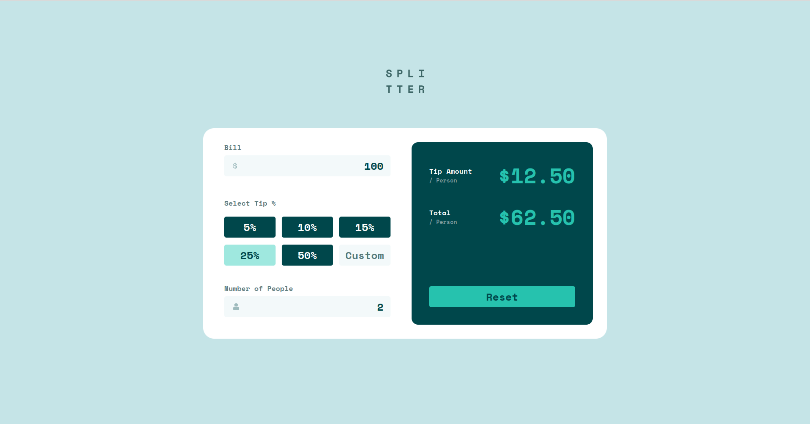

# Frontend Mentor - Tip calculator app solution

This is a solution to the [Tip calculator app challenge on Frontend Mentor](https://www.frontendmentor.io/challenges/tip-calculator-app-ugJNGbJUX). Frontend Mentor challenges help you improve your coding skills by building realistic projects.

## Table of contents

- [Overview](#overview)
  - [The challenge](#the-challenge)
  - [Screenshot](#screenshot)
  - [Links](#links)
- [My process](#my-process)
  - [Built with](#built-with)
  - [Useful resources](#useful-resources)

## Overview

### The challenge

Users should be able to:

- View the optimal layout for the app depending on their device's screen size
- See hover states for all interactive elements on the page
- Calculate the correct tip and total cost of the bill per person

### Screenshot:

### Links

- Solution URL: [Click for solution](https://github.com/DavitGe/tip-calculator-app)
- Live Site URL: [Click to visit project](https://davitge.github.io/tip-calculator-app/)

## My process

### Built with

- Semantic HTML5 markup
- CSS custom properties
- Flexbox
- CSS Grid
- Mobile-first workflow
- [React](https://reactjs.org/) - JS library
- [TailwindCss](https://tailwindcss.com) - For styles

### Useful resources

- [Tailwindcss docs](https://tailwindcss.com/docs) - Helped me to find right styling solutions. I really liked this pattern and will use it going forward.
- [Example resource 2](https://reactjs.org/docs/hooks-reference.html#usestate) - This is an amazing article which helped me finally understand how useState works. I'd recommend it to anyone still learning this concept.
